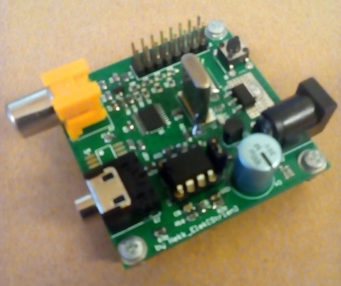

# Teletext is not dead
This is the source code of our demo for Function 2019, where it ended up on 3rd place in wild category. 
[You can find it on Pouet too.](http://www.pouet.net/prod.php?which=82943)

## What does it run on?
It runs on a custom hardware based on STM32F030F4, one of the cheapest microcontrollers, with an ARM Cortex-M0 CPU, 16k flash and 4k of RAM. To see the pictures and animation, connect its composite video output to a television AV-input and open teletext page 100.

## Theory of operation
Microcontrollers does not have any composite video output, let alone teletext output. Therefore some software magic was necessary: TIM3 runs in PWM mode and generates the video syncronization signal. Its duty cycle is updated in IT routine, so proper interlaced PAL syncronization is achieved. The teletext signal is then superimposed on the video signal by SPI1. SPI1 is fed by a DMA channel, however to achive proper timings, the DMA channel is configured by an another DMA channel which is triggered by TIM3.

## How do I build the hardware?
The gerber files are located at [hardware/fab](hardware/fab/DemoPlatform_Rev_A.rar). In the same directory you can find the [schematics](hardware/fab/DemoPlatform_Rev_A.pdf) too.
Some notes about assembly:
- Resistors with value "DNP" should not be placed (DNP==Do not place).
- The audio output and the EEPROM are not used, their assembly is optional.
- 13.875 MHz crystals are not common. Make sure you can source them.

The hardware was designed using Altium Designer 2011.

## How can I compile the software?
The demo is written in C and compiled using IAR Embedded Workbench for ARM 6.50. The final binary size is 15760 bytes.

Shout out to Gergely Vakulya, who made it compile with GCC. GCC project can be found [here](gcc/txt_gcc_make.tar.gz).

## Possible upgrades
- Sound is not yet implemented, but it is possible to use PWM output as a poor-man's audio DAC.
- With proper resistor values, it is possible to generate low-resolution 16-level grayscale images on the video output.
- The I2C EEPROM can be used to store demo-related data up to 128kbytes.
- It is possible to add a daughterboard to P1.

## Any remarks?
Feel free to reuse the hardware and the drivers to make teletext demos :)

## Credits
- Hardware and code by Hekk_Elek
- Teletext pages and music by And/or
- 3D graphics by Alex
- Voice by Brett
